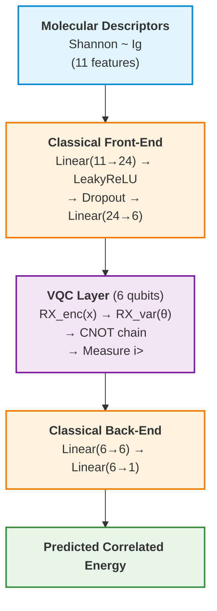

# QME-VQNet: Quantum-Classical Hybrid Framework for Molecular Correlated Energy Prediction

[](https://github.com/OriginQ/ITA-QML/releases/tag/v1.0.0)
[](https://www.python.org/)
[](LICENSE)

> **Paper**: *[Paper Title — To Be Added]*  
> **Link**: *[DOI / arXiv — To Be Added]*

> :cn: **中文文档**: [docs/README_CN.md](docs/README_CN.md)

---

**QME-VQNet** is a quantum-classical hybrid machine learning framework for quantum chemistry, designed to **predict correlated electronic energies of molecular systems**. It implements a variational quantum circuit (VQC) model embedded within a classical neural network, alongside classical MLP baselines, with dual-backend support (pyvqnet quantum simulator + PyTorch), K-fold cross-validation, early stopping, and a complete training pipeline.

## Key Features

| Feature | Description |
|---|---|
| **Quantum-Classical Hybrid** | VQC layer with RX angle encoding, trainable variational gates, and CNOT entanglement, sandwiched between classical layers |
| **Multi-Backend** | pyvqnet (quantum simulation) + PyTorch (classical), switchable via a single config key |
| **K-Fold Cross-Validation** | Reproducible K-fold CV with per-fold and summary metrics |
| **Early Stopping** | Patience-based early stopping with best-weight restoration |
| **LR Scheduling** | ReduceLROnPlateau scheduler with configurable patience and decay factor |
| **Gradient Clipping** | Max-norm gradient clipping for training stability |
| **Comprehensive Metrics** | RMSE, Pearson r, Spearman ρ, R² per fold and across folds |
| **Modular Architecture** | Registry-based dispatch for models, datasets, and trainers — add new models in 3 steps |
| **Reproducible Environments** | pixi-managed lockfile environments for identical dependencies across machines |

## Architecture



The VQC layer is equivalent to PennyLane's `AngleEmbedding + BasicEntanglerLayers → PauliZ` expectation, implemented with VQNet's built-in automatic-differentiation simulator.

## Quick Start

### Prerequisites

Install [pixi](https://pixi.sh) (recommended), or use your own conda/venv with the dependencies listed in [pixi.toml](pixi.toml).

```bash
# Install pixi
curl -fsSL https://pixi.sh/install.sh | bash

# Clone and install environments
git clone git@github.com:OriginQ/ITA-QML.git
cd ITA-QML

pixi install              # default: pyvqnet (quantum simulator)
pixi install -e torch     # PyTorch (classical models)
```

### Run

```bash
# Quick smoke test — single fold
pixi run test

# Full VQC training — 10-fold CV
pixi run train

# Classical MLP baseline (pyvqnet)
pixi run train-classical

# Classical MLP baseline (PyTorch)
pixi run -e torch train-torch
```

Or use the CLI directly for full control:

```bash
python train.py --config configs/train_config.json
python train.py --backend classical_torch --target-col Corr_CCSD
python train.py --epochs 200 --lr 0.0005 --batch-size 64
python train.py --data-path data/ben.csv --n-splits 5
```

## Configuration

All training parameters are controlled via a JSON file ([configs/train_config.json](configs/train_config.json)). Any parameter can be overridden at the command line.

| Section | Key | Description |
|---|---|---|
| `task` | `backend` | `vqc` (quantum hybrid), `classical` (pyvqnet MLP), `classical_torch` (PyTorch MLP) |
| `task` | `dataset` | Dataset loader name (default: `csv_regression`) |
| `data` | `csv_path` | Path to the CSV data file |
| `data` | `target_col` | Regression target: `Corr_MP2`, `Corr_CCSD`, `Corr_CCSD(T)` |
| `data` | `n_splits` | Number of cross-validation folds |
| `model` | `qubit_num` | Number of qubits (VQC only) |
| `model` | `hidden_size` | Hidden-layer dimension for classical blocks |
| `training` | `epochs` | Maximum training epochs |
| `training` | `lr` | Initial learning rate |
| `training` | `early_stop` | Enable early stopping |
| `training` | `patience` | Patience for both early stopping and LR scheduler |
| `output` | `model_dir` | Directory for saved model checkpoints |
| `output` | `plot_dir` | Directory for prediction scatter plots |

## Project Structure

```
qme_vqnet/
├── configs/
│   └── train_config.json      # Default training configuration
├── data/
│   ├── dataset.py             # CSV data loader + K-fold splitter
│   └── *.csv                  # Molecular datasets
├── models/
│   ├── __init__.py            # Model registry
│   ├── quantum_model.py       # VQCLayer + QNet (quantum-classical hybrid)
│   ├── classical.py           # ClassicalNet (pyvqnet MLP baseline)
│   └── classical_torch.py     # DeepMLP (PyTorch MLP baseline)
├── train/
│   ├── trainer.py             # Trainer dispatcher + shared metrics
│   ├── trainer_vqnet.py       # pyvqnet training loop
│   └── trainer_torch.py       # PyTorch training loop
├── utils/
│   └── plot.py                # Scatter-plot generation
├── main.py                    # Quick-test entry point (single fold)
├── train.py                   # Full CLI training entry point
├── pixi.toml                  # Environment & task definitions
└── pixi.lock                  # Locked dependency versions
```

## Datasets

All CSV files follow a unified format: column 0 = index, columns 1–11 = 11 molecular descriptors (Shannon through Ig), remaining columns = regression targets.

| File | Samples | Available Targets |
|---|---|---|
| `ben.csv` | 1,180 | `Corr_MP2`, `Corr_CCSD`, `Corr_CCSD(T)` |
| `C60_new.csv` | 1,811 | `Corr_MP2` |
| `Cr2_new.csv` | 299 | `Corr_MP2` |
| `all_FCI_H8.csv` | 4,000 | `Corr_MP2` |
| `all_RHF_H8.csv` | 4,000 | `Corr_MP2` |
| `water_mp2_ccsd_ccsdt.csv` | 1,886 | `Corr_MP2`, `Corr_CCSD`, `Corr_CCSD(T)` |

Switch regression targets by changing `data.target_col` in the JSON config — no code changes required.

## Extending the Framework

### Adding a New Model

1. **Implement** the model class in `models/` (constructor must accept `**model_cfg`).
2. **Register** it in `models/__init__.py` under the appropriate framework block.
3. (Optional) **Add a trainer** in `train/` for custom training logic. The existing trainer handles any `torch.nn.Module` or pyvqnet `Module` automatically.

```python
# models/__init__.py
from models.my_model import MyNet
MODEL_REGISTRY['my_net'] = MyNet
```

```bash
# Use it immediately
python train.py --backend my_net --config configs/my_config.json
```

For detailed step-by-step instructions, see [docs/COLLABORATOR_GUIDE.md](docs/COLLABORATOR_GUIDE.md) (Chinese).

### Adding a New Dataset Loader

1. Implement a loader function in `data/dataset.py` that returns `(features, labels, feature_scaler, label_scaler)`.
2. Register it in `DATASET_REGISTRY`.

## Environments

| Environment | Framework | Purpose |
|---|---|---|
| `pyvqnet` (default) | pyvqnet + pyqpanda3 | VQC quantum simulation, classical MLP (pyvqnet) |
| `torch` | PyTorch CPU | Classical deep MLP training |

Both environments are fully isolated with locked dependency versions in `pixi.lock`.

---

## Citation

If you use QME-VQNet in your research, please cite:

```bibtex
@article{XXX,
  title     = {[Paper Title — To Be Added]},
  author    = {[Authors — To Be Added]},
  journal   = {[Journal — To Be Added]},
  year      = {2026},
  doi       = {[DOI — To Be Added]},
  url       = {[URL — To Be Added]}
}
```

## License

This project is licensed under the MIT License. See [LICENSE](LICENSE) for details.
