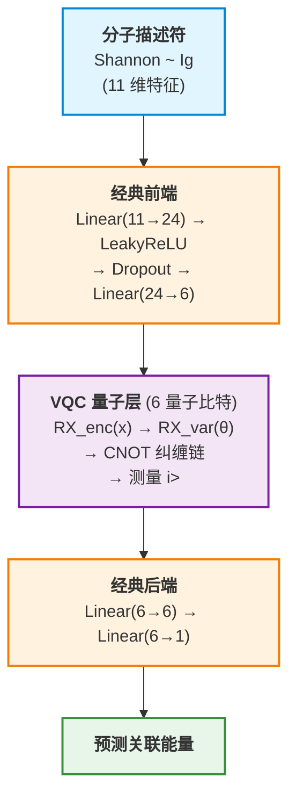

# QME-VQNet: 量子-经典混合分子相关能预测框架

[](https://github.com/OriginQ/ITA-QML/releases/tag/v1.0.0)
[](https://www.python.org/)
[](LICENSE)

> **论文**: *[论文标题 — 待补充]*  
> **链接**: *[DOI / arXiv — 待补充]*

> :us: **English docs**: [README.md](../README.md)

---

**QME-VQNet** 是一个面向量子化学的量子-经典混合机器学习框架，专为 **预测分子体系的相关电子能量** 设计。该项目实现了变分量子电路 (VQC) 与经典神经网络的混合模型，同时提供了纯经典 MLP 基线，支持双后端 (pyvqnet 量子模拟器 + PyTorch)、K 折交叉验证、早停、学习率调度等完整训练基础设施。

## 核心特性

| 特性 | 说明 |
|---|---|
| **量子-经典混合** | VQC 层包含 RX 角度编码、可训练变分门和 CNOT 纠缠，嵌入经典神经网络中 |
| **多后端支持** | pyvqnet (量子模拟) + PyTorch (经典)，通过一个配置键即可切换 |
| **K 折交叉验证** | 可复现的 K 折 CV，支持逐折和汇总指标 |
| **早停机制** | 基于耐心值的早停，自动恢复最佳权重 |
| **学习率调度** | ReduceLROnPlateau 调度器，可配置耐心值和衰减因子 |
| **梯度裁剪** | 最大范数梯度裁剪，保证训练稳定性 |
| **全面评估指标** | RMSE、Pearson r、Spearman ρ、R²，逐折和整体统计 |
| **模块化架构** | 基于注册中心的模型/数据集/训练器派发 — 三步接入新模型 |
| **可复现环境** | pixi 锁文件管理环境，跨机器依赖版本完全一致 |

## 模型架构



VQC 层等价于 PennyLane 的 `AngleEmbedding + BasicEntanglerLayers → PauliZ` 期望值测量，使用 VQNet 内置的自动微分模拟器实现。

## 快速开始

### 环境准备

推荐使用 [pixi](https://pixi.sh) 管理环境，也可使用自己的 conda/venv，依赖列表见 [pixi.toml](../pixi.toml)。

```bash
# 安装 pixi
curl -fsSL https://pixi.sh/install.sh | bash

# 克隆项目并安装环境
git clone git@github.com:OriginQ/ITA-QML.git
cd ITA-QML

pixi install              # 默认: pyvqnet (量子模拟)
pixi install -e torch     # PyTorch (经典模型)
```

### 运行

```bash
# 快速测试 — 单折训练
pixi run test

# VQC 完整训练 — 10 折交叉验证
pixi run train

# 经典 MLP 基线 (pyvqnet 框架)
pixi run train-classical

# 经典 MLP 基线 (PyTorch 框架)
pixi run -e torch train-torch
```

或直接使用 CLI 完全控制：

```bash
python train.py --config configs/train_config.json
python train.py --backend classical_torch --target-col Corr_CCSD
python train.py --epochs 200 --lr 0.0005 --batch-size 64
python train.py --data-path data/ben.csv --n-splits 5
```

## 配置说明

所有训练参数通过 JSON 文件控制 ([configs/train_config.json](../configs/train_config.json))，任何参数均可通过命令行覆盖。

| 配置段 | 参数 | 说明 |
|---|---|---|
| `task` | `backend` | `vqc` (量子混合), `classical` (pyvqnet MLP), `classical_torch` (PyTorch MLP) |
| `task` | `dataset` | 数据集加载器名称 (默认: `csv_regression`) |
| `data` | `csv_path` | CSV 数据文件路径 |
| `data` | `target_col` | 回归目标: `Corr_MP2`, `Corr_CCSD`, `Corr_CCSD(T)` |
| `data` | `n_splits` | 交叉验证折数 |
| `model` | `qubit_num` | 量子比特数 (仅 VQC) |
| `model` | `hidden_size` | 经典隐藏层维度 |
| `training` | `epochs` | 最大训练轮数 |
| `training` | `lr` | 初始学习率 |
| `training` | `early_stop` | 启用早停 |
| `training` | `patience` | 早停和调度器的耐心值 |
| `output` | `model_dir` | 模型保存目录 |
| `output` | `plot_dir` | 预测散点图保存目录 |

## 项目结构

```
qme_vqnet/
├── configs/
│   └── train_config.json      # 默认训练配置
├── data/
│   ├── dataset.py             # CSV 数据加载 + K 折分割
│   └── *.csv                  # 分子数据集
├── models/
│   ├── __init__.py            # 模型注册中心
│   ├── quantum_model.py       # VQCLayer + QNet (量子-经典混合)
│   ├── classical.py           # ClassicalNet (pyvqnet MLP 基线)
│   └── classical_torch.py     # DeepMLP (PyTorch MLP 基线)
├── train/
│   ├── trainer.py             # 训练器调度 + 公共指标
│   ├── trainer_vqnet.py       # pyvqnet 训练循环
│   └── trainer_torch.py       # PyTorch 训练循环
├── utils/
│   └── plot.py                # 散点图生成
├── main.py                    # 快速测试入口 (单折)
├── train.py                   # 完整 CLI 训练入口
├── pixi.toml                  # 环境 & 任务定义
└── pixi.lock                  # 锁定依赖版本
```

## 数据集

所有 CSV 文件遵循统一格式: 第 0 列为序号, 第 1~11 列为 11 维分子描述符 (Shannon ~ Ig), 其余列为回归目标。

| 文件 | 样本数 | 可选目标列 |
|---|---|---|
| `ben.csv` | 1,180 | `Corr_MP2`, `Corr_CCSD`, `Corr_CCSD(T)` |
| `C60_new.csv` | 1,811 | `Corr_MP2` |
| `Cr2_new.csv` | 299 | `Corr_MP2` |
| `all_FCI_H8.csv` | 4,000 | `Corr_MP2` |
| `all_RHF_H8.csv` | 4,000 | `Corr_MP2` |
| `water_mp2_ccsd_ccsdt.csv` | 1,886 | `Corr_MP2`, `Corr_CCSD`, `Corr_CCSD(T)` |

修改 JSON 配置中的 `data.target_col` 即可切换回归目标，无需改动任何代码。

## 扩展框架

### 添加新模型

1. **实现**模型类于 `models/` 目录下 (构造函数需接受 `**model_cfg`)。
2. **注册**到 `models/__init__.py` 对应的框架块中。
3. (可选) 如需自定义训练逻辑，在 `train/` 中**添加训练器**。现有训练器已自动支持任意 `torch.nn.Module` 或 pyvqnet `Module`。

```python
# models/__init__.py
from models.my_model import MyNet
MODEL_REGISTRY['my_net'] = MyNet
```

```bash
# 立即使用
python train.py --backend my_net --config configs/my_config.json
```

详细的分步指南见 [docs/COLLABORATOR_GUIDE.md](COLLABORATOR_GUIDE.md)。

### 添加新数据集

1. 在 `data/dataset.py` 中实现加载函数，返回 `(features, labels, feature_scaler, label_scaler)`。
2. 注册到 `DATASET_REGISTRY`。

## 运行环境

| 环境 | 框架 | 用途 |
|---|---|---|
| `pyvqnet` (默认) | pyvqnet + pyqpanda3 | VQC 量子模拟, 经典 MLP (pyvqnet) |
| `torch` | PyTorch CPU | 经典深度 MLP 训练 |

两个环境完全隔离，依赖版本由 `pixi.lock` 锁定。

---

## 引用

如果您在研究中使用了 QME-VQNet，请引用：

```bibtex
@article{XXX,
  title     = {[论文标题 — 待补充]},
  author    = {[作者 — 待补充]},
  journal   = {[期刊 — 待补充]},
  year      = {2026},
  doi       = {[DOI — 待补充]},
  url       = {[URL — 待补充]}
}
```

## 许可证

本项目基于 MIT 许可证开源。详见 [LICENSE](../LICENSE)。
